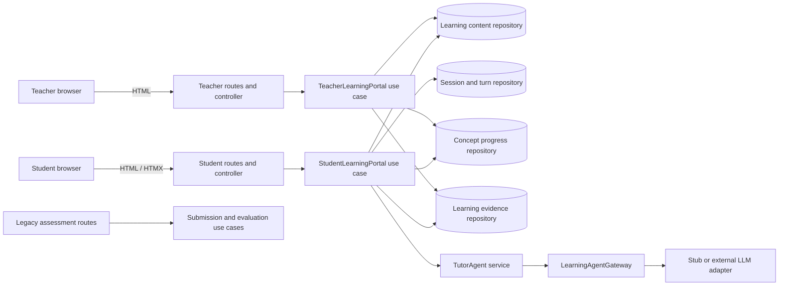
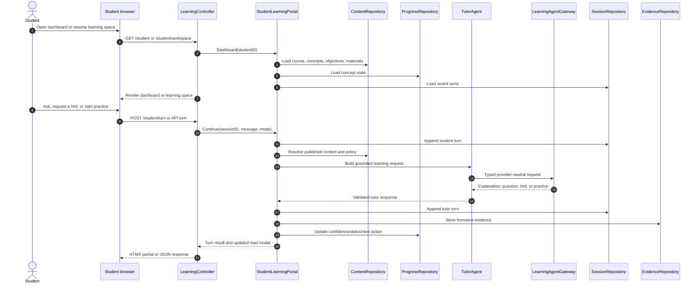
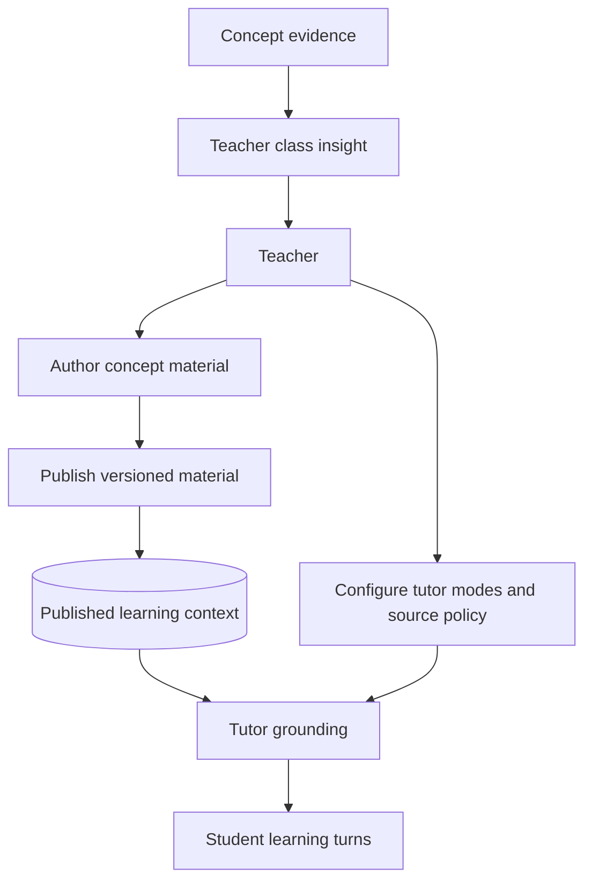
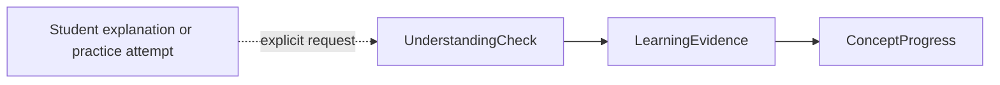
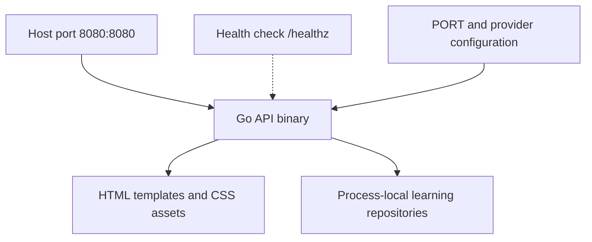

# Co-Learning Architecture

> **Architecture status:** the first vertical slice is implemented. The copied requirement in `docs/project-problem-statement.md` is intentionally preserved as-is; this document describes the product direction and implementation boundary we are building toward.

## Product thesis

CoLearn is a teacher-grounded learning application. The student does not need to submit work to unlock the next interaction. The student asks, practices, reflects, and resumes a learning thread while the tutor agent uses teacher-provided context and approved external sources to choose a useful next turn.

The existing automated evaluation pipeline remains a **formative-check sidecar**. It is not the center of the student experience and is not required for a normal learning turn.

## Architectural style

The Go application keeps the existing n-layered dependency direction:

```text
routes -> controllers -> usecases -> domain
                              |  -> repository ports
                              |  -> service ports
                              v
                         adapters implement ports
```

The new learning path is parallel to the legacy assessment path. It does not overload `Submission` or `Evaluation`, because those entities are keyed to assignments and would corrupt conversational history.

## System context



The dashboard pages and the JSON API call the same use cases. The UI therefore cannot create a second business-logic path.

## Student learning loop



## Teacher content loop



The teacher owns:

- concepts and learning objectives
- published learning material
- source labels and provenance
- the allowed tutor modes
- whether external sources may be used

External material is supported by the model, but the first slice uses seeded external references. A production retrieval adapter can be added behind the same content boundary later.

## Domain model

| Concept | Responsibility |
|---|---|
| `LearningCourse` | A teacher-owned learning space and tutor policy container. |
| `LearningConcept` | An ordered idea with prerequisites and estimated learning time. |
| `LearningObjective` | The observable outcome for a concept. |
| `LearningMaterial` | Versioned teacher or external context with provenance. |
| `LearningSession` | A resumable student/course/concept conversation. |
| `LearningTurn` | A student or tutor message with mode and source references. |
| `LearningEvidence` | A formative signal extracted from a learning interaction. |
| `UnderstandingCheck` | An explicit, optional formative check over a student explanation. |
| `ConceptProgress` | Status, confidence, evidence count, and next action. |

`ConceptProgress.Confidence` is a learning signal, not a final grade. The optional evaluator may contribute evidence, but it does not own the learner's state.

## Tutor agent contract

The agent gateway is provider-neutral:

```text
LearningRequest
  learner, course, concept, session
  current message
  selected tutor mode
  objective
  published materials and source references
  recent turns
  learner progress snapshot
  tutor policy

LearningResponse
  response kind
  explanation / question / hint / practice / summary
  validated source references
  evidence drafts
  confidence delta
  next action
  escalation flag
```

Supported modes are data values rather than transport branches:

- `guided`
- `socratic`
- `direct`
- `practice`
- `hint`
- `diagnostic`

The response policy rejects empty or unknown response kinds, constrains confidence deltas, and removes source references that are not part of the current published context. External references are removed when the course policy disallows them.

## Optional formative evaluation

Evaluation is deliberately outside the normal learning request path:



The first slice includes a lightweight `UnderstandingCheck` endpoint and a deterministic formative-check gateway. It evaluates the most recent student turn, stores evidence, and updates concept progress. The legacy `StagedEvaluationPipeline` remains isolated in `service/evaluation.go` for compatibility work and is not wired into the primary co-learning bootstrap. A production checker can add rubric/provider versioning without coupling the tutor to assignment submissions or final grades.

## Repository and adapter boundaries

Current learning ports:

- `LearningContentRepository`
- `LearningSessionRepository`
- `ConceptProgressRepository`
- `LearningEvidenceRepository`
- `UnderstandingCheckRepository`
- `LearningAgentGateway`
- `FormativeCheckGateway`

Current adapters:

- thread-safe in-memory repositories
- deterministic `StubLearningAgentGateway`
- deterministic `StubFormativeCheckGateway`
- server-rendered templates with a shared CSS token system
- legacy in-memory submission/evaluation repositories behind compatibility routes

Production follow-up adapters should provide durable persistence, authenticated actors, source fetching/normalization, and a real model provider. Source content must be treated as untrusted input and cannot override tutor instructions.

## HTTP surface

### HTML surfaces

| Route | Purpose |
|---|---|
| `GET /` | Product landing and role entry point |
| `GET /student` | Student learning dashboard |
| `GET /student/workspace` | Resumable tutor conversation |
| `POST /student/session` | Start or resume a session |
| `POST /student/turn` | Submit a student turn; supports HTMX partial response |
| `GET /teacher` | Teacher class dashboard |
| `GET /teacher/content` | Content studio and tutor policy controls |
| `POST /teacher/materials` | Publish a learning note |
| `POST /teacher/tutor-policy` | Update allowed tutor modes and source policy |

The `/faculty` routes remain as compatibility aliases; the product language and canonical path are **teacher**. The API accepts `role=teacher` or `role=faculty` for this transition.

### JSON API

The versioned contract is documented in [`docs/api.md`](api.md). The first slice exposes:

```text
GET  /api/v1/student/dashboard
POST /api/v1/student/sessions
GET  /api/v1/student/sessions/{session_id}
POST /api/v1/student/sessions/{session_id}/turns
POST /api/v1/student/sessions/{session_id}/understanding-checks
GET  /api/v1/teacher/dashboard
POST /api/v1/teacher/materials
PUT  /api/v1/teacher/courses/{course_id}/tutor-policy
```

The current middleware uses a query parameter or `X-Role` header only to make the demo runnable. A real authentication adapter must replace this before deployment; client-supplied student IDs must not be treated as authority in production.

## UI architecture

The UI is intentionally data-oriented and polished without pretending that the core is complete.

### Student dashboard

- Continue-learning hero
- current concept confidence and next action
- ordered concept path
- recent conversation activity
- source/context library
- teacher and tutor-policy context

### Student learning space

- persistent transcript
- configurable tutor mode selector
- source chips on tutor responses
- clear empty state before the first turn
- HTMX partial refresh for new turns

### Teacher dashboard

- class-level concept confidence
- support queue
- evidence activity stream
- content health
- live tutor-policy summary

### Teacher content studio

- published material list
- provenance labels and references
- publish material form
- configurable tutor modes
- external-source policy

## Container architecture and deployment

The current image keeps the same non-root Go process and adds the shared template assets to the image:



The first slice intentionally uses process-local memory so the UI and API can be reviewed without introducing a database migration. A durable adapter can replace the memory repositories without changing the browser or JSON contract.

## Compatibility and migration

The old assessment model remains in a separate path:

```text
legacy /student/submit       -> Submission -> Evaluation
legacy /faculty/summary      -> Submission/Evaluation aggregates
new    /student/turn         -> LearningSession -> LearningTurn -> Evidence
new    /teacher/content      -> LearningMaterial + TutorPolicy
```

This separation is intentional. It lets the new UI and API contract stabilize before we decide whether any assessment concepts should be migrated into formative checks.

## Current limitations and next steps

1. Replace demo role/student identity with authenticated actors and ownership checks.
2. Add durable database repositories behind the existing ports.
3. Add a bounded external-source fetcher with URL, redirect, size, and content normalization controls.
4. Add a real LLM adapter and citation verification behind `LearningAgentGateway`.
5. Add provider/versioned rubric policy to the optional understanding check.
6. Add authorization tests for every teacher, student, and session endpoint.
7. Add browser-level tests for the shared dashboard shell and HTMX turn flow.

The problem statement remains unchanged as the original requirement record. Product interpretation and implementation decisions live in this document and the API/UI documentation.
