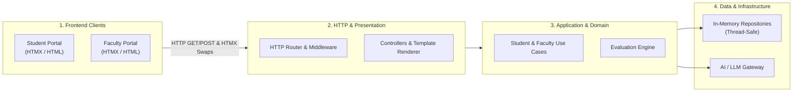
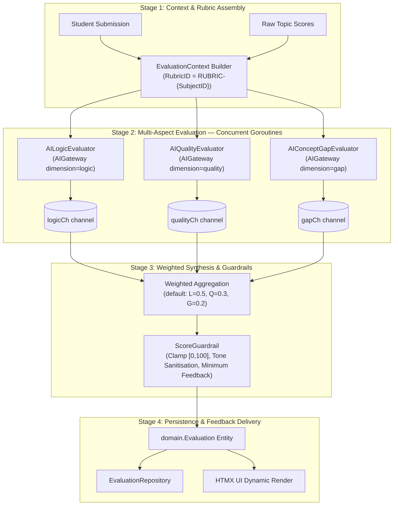
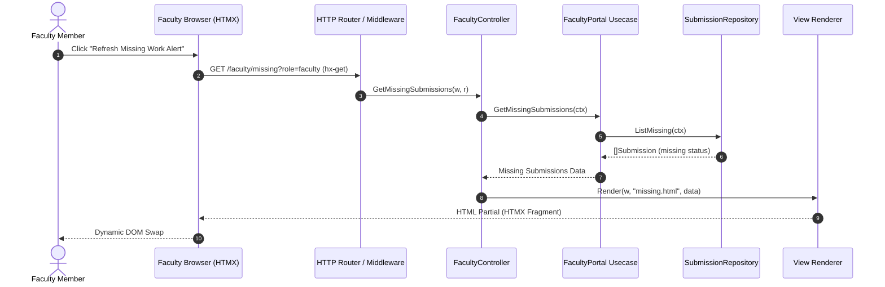
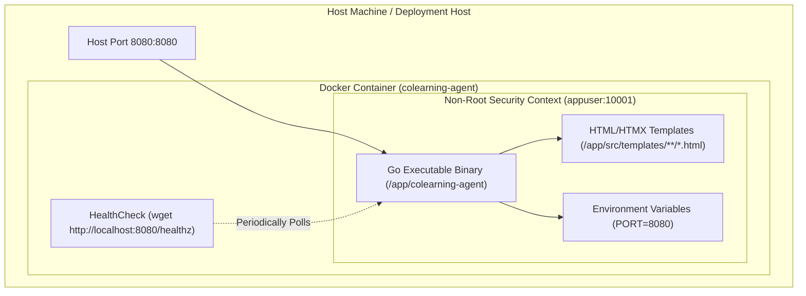

# Project Architecture

## Architectural Style

The application follows an n-layered architecture with all Go packages under `/src`, preserving clear dependency direction and SOLID boundaries.

Dependency direction:

`routes -> controller -> usecase -> repository interfaces`

`usecase -> service`

`adapter -> repository interfaces`

`domain` remains dependency-free from outer layers.

## High-Level System Architecture



## Staged AI Evaluation Pipeline Architecture

Instead of relying on a monolithic prompt call, the evaluation engine employs a **staged, multi-aspect processing pipeline**. This design ensures deterministic scoring, structured topic mapping, and verifiable safety guardrails.



### Pipeline Stage Rationale

1. **Stage 1 (Context Assembly)**: Constructs a typed `EvaluationContext` carrying the submission, a deterministic `RubricID` (`RUBRIC-{SubjectID}`), and raw topic scores. No LLM call here — this stage is free and synchronous.
2. **Stage 2 (Concurrent Multi-Aspect Evaluation)**: Three sub-evaluators (`AILogicEvaluator`, `AIQualityEvaluator`, `AIConceptGapEvaluator`) each send a typed `PromptRequest` to the injected `AIGateway` and receive a typed `PromptResponse`. They run in three goroutines; results are collected over buffered channels with a `ctx.Done()` select arm, so any upstream deadline propagates cleanly.
3. **Stage 3 (Synthesis & Guardrails)**: Each sub-score is normalised to a percentage, then combined with configurable weights via the `WithWeights` functional option. `ScoreGuardrail` then clamps the aggregate to `[0, 100]`, strips prohibited-tone feedback lines, and ensures at least one feedback sentence always exists before the entity leaves the service layer.
4. **Stage 4 (Persistence & Feedback)**: Returns a fully validated `domain.Evaluation` ready for persistence and HTMX rendering without further transformation.

### AIGateway Port & Adapter Strategy

The `repository.AIGateway` interface accepts a typed `PromptRequest` (dimension, rubric ID, content, topic hints, max score) and returns a typed `PromptResponse` (score, observations, weak topics). This explicit contract means:
- **No LLM SDK leaks** into the service layer — the pipeline imports only `repository`, not any provider SDK.
- **Swapping providers is a single-line bootstrap change**: `memory.NewStubAIGateway()` → `openai.NewAdapter(cfg)` or `anthropic.NewAdapter(cfg)`.
- **Tests use `StubAIGateway`** (deterministic, rule-based) so the full four-stage pipeline including concurrency, guardrails, and weighted aggregation is exercised without network I/O.

## Detailed Layered Component Architecture

```mermaid
graph TD
    subgraph Clients["Clients / Browser Layer"]
        StudentBrowser["Student Browser (HTMX / HTML)"]
        FacultyBrowser["Faculty Browser (HTMX / HTML)"]
    end

    subgraph Presentation["Presentation & Routing Layer"]
        Router["HTTP Mux (routes.Register)"]
        AuthMW["Auth & Session Middleware"]
        RoleMW["Role Gating Middleware"]
        HealthCtrl["HealthController"]
        StudentCtrl["StudentController"]
        FacultyCtrl["FacultyController"]
        ViewRenderer["View Renderer (HTML Templates)"]
    end

    subgraph Application["Application / Use Case Layer"]
        StudentUC["StudentPortal UseCase"]
        FacultyUC["FacultyPortal UseCase"]
        SummariesDTO["Derived Read Models (Faculty/Student Summaries)"]
    end

    subgraph ServiceLayer["Domain Service Layer"]
        EvalEngine["DefaultEvaluationEngine (pure-math fallback)"]
        StagedPipeline["StagedEvaluationPipeline"]
        LogicEval2["AILogicEvaluator"]
        QualityEval2["AIQualityEvaluator"]
        GapEval2["AIConceptGapEvaluator"]
        Guardrail2["ScoreGuardrail"]
    end

    subgraph Abstractions["Repository & Gateway Abstractions"]
        SubRepoIntf["SubmissionRepository (Interface)"]
        EvalRepoIntf["EvaluationRepository (Interface)"]
        AIGatewayIntf["AIGateway / LLMProvider (Interface)"]
        FileStorageIntf["FileStorage (Interface)"]
    end

    subgraph Adapters["Infrastructure & Concrete Adapters"]
        MemSubRepo["MemorySubmissionRepository (sync.RWMutex)"]
        MemEvalRepo["MemoryEvaluationRepository (sync.RWMutex)"]
        LLMAdapter["OpenAI / Anthropic LLM Adapter"]
        DiskFileStorage["LocalDiskFileStorage"]
    end

    subgraph DomainLayer["Core Domain Models"]
        SubDomain["Submission Entity"]
        EvalDomain["Evaluation Entity"]
    end

    StudentBrowser -->|HTTP GET/POST| Router
    FacultyBrowser -->|HTTP GET/POST| Router

    Router --> AuthMW
    AuthMW --> RoleMW
    RoleMW --> HealthCtrl
    RoleMW --> StudentCtrl
    RoleMW --> FacultyCtrl

    StudentCtrl --> StudentUC
    FacultyCtrl --> FacultyUC
    StudentCtrl --> ViewRenderer
    FacultyCtrl --> ViewRenderer

    StudentUC --> SubRepoIntf
    StudentUC --> EvalRepoIntf
    StudentUC --> FileStorageIntf
    StudentUC -.->|Returns| SummariesDTO

    FacultyUC --> SubRepoIntf
    FacultyUC --> EvalRepoIntf
    FacultyUC -.->|Returns| SummariesDTO

    EvalEngine --> AIGatewayIntf
    EvalEngine --> SubDomain
    EvalEngine --> EvalDomain

    LLMAdapter -.->|Implements| AIGatewayIntf
    MemSubRepo -.->|Implements| SubRepoIntf
    MemEvalRepo -.->|Implements| EvalRepoIntf
    DiskFileStorage -.->|Implements| FileStorageIntf

    MemSubRepo --> SubDomain
    MemEvalRepo --> EvalDomain

    ViewRenderer -.->|Renders Feedback & Status| StudentBrowser
```



## Component Sequence Diagram (HTMX Partial Refresh)



## Repository Layout

```text
src/
  cmd/api/                     # application entrypoint
  adapter/                     # concrete integrations (in-memory/db/ai providers)
  bootstrap/                   # dependency wiring and application composition
  config/                      # runtime settings
  controller/                  # HTTP request orchestration and IO mapping
  domain/                      # entities, value objects, and business rules
  repository/                  # abstraction interfaces for data access
  routes/                      # route registration and middleware
  service/                     # evaluation and feedback services
  templates/                   # server-rendered HTML + HTMX partial templates
  usecase/                     # application workflows (student/faculty logic)
  view/                        # rendering helpers
planning/                      # feature plans and user stories
docs/                          # project-level documentation
```

## Layer Responsibilities

- **Domain**: Core entities (`Submission`, `Evaluation`) representing clean domain business rules.
- **Application / UseCase**: Student and faculty workflows (`StudentPortal`, `FacultyPortal`), generating derived read DTOs (`FacultyDashboard`, `StudentDashboard`, `SubjectSummary`).
- **Repository & Abstractions**: Segregated interfaces (`SubmissionRepository`, `EvaluationRepository`, `FileStorage`, `AIGateway`) for data persistence, file storage, and AI integrations.
- **Service**: Evaluation logic split into two tiers: (1) `DefaultEvaluationEngine` — pure-math fallback for seeding/testing; (2) `StagedEvaluationPipeline` — orchestrates `AILogicEvaluator`, `AIQualityEvaluator`, `AIConceptGapEvaluator` concurrently via goroutines/channels, followed by `ScoreGuardrail`. Weights configurable via `WithWeights` functional option.
- **Adapter**: Infrastructure implementations; thread-safe in-memory repositories (using `sync.RWMutex`); `StubAIGateway` (deterministic rule-based, satisfies `repository.AIGateway`); placeholder stubs for real LLM adapters.
- **Controller**: HTTP handlers that validate inputs and orchestrate use cases.
- **Routes & Middleware**: Endpoint registration, session/auth extraction, and role gating middleware (`roleRequired`).
- **View/Templates**: Server-side HTML rendering with HTMX-based partial refresh for both portals.
- **Bootstrap/Config**: Environment/config loading and dependency assembly.

## Role-Specific Interfaces

- **Student portal**: submission upload, status tracking, marks, feedback timeline.
- **Faculty portal**: completion monitoring, missing/overdue alerts, subject/topic mastery summaries.

Both flows are exposed through HTTP handlers with role-aware access checks.

## HTMX + Template Strategy

- Full-page endpoints render initial Student and Faculty pages.
- HTMX partial endpoints refresh submissions, summaries, and missing-work alerts.
- Templates are kept modular by role and endpoint intent.

## Container Architecture & Deployment



